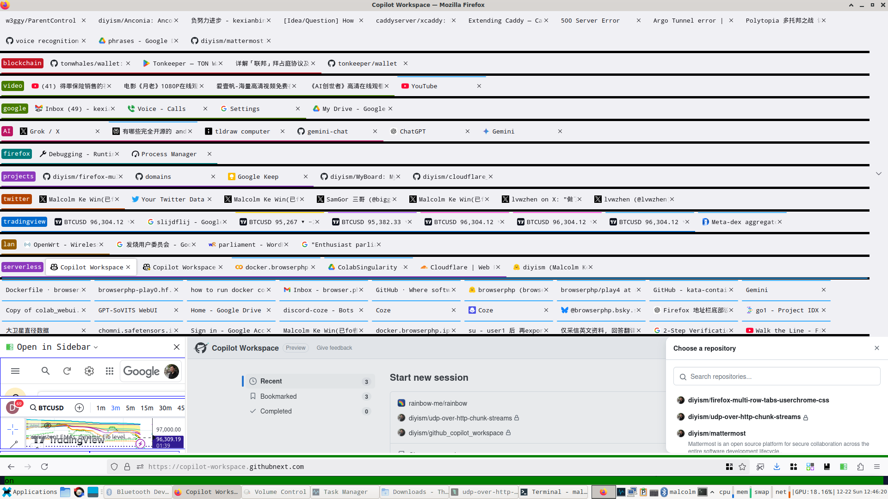

# The simplest firefox multi-row tabs solution in the world:
How to create a tab-group seperator(thick black line):

type "about:unloads" into the address bar to get a 5px hight black line seperator,
and right click the seperator and click "New Tab to right" to create the first tab in the group

mouse-over to show 16 rows of tabs, mouse-out to show only 2 rows

# Now my tabs bar is a visable/live/intuitive bookmarks bar, an effective bookmarks bar!
I think it's way better than "Simple Tab Groups, Tree Style Tab, OneTab" which I used before.

# Look at my crazy 1300 tabs in groups:

# How to install:
    in firefox open "about:config":
    set     browser.startup.page=3              (or Settings > General > Restore previous windows and tabs)
    set     toolkit.legacyUserProfileCustomizations.stylesheets=true
    set     userchrome.multirowtabs.scrollbar-handle.enabled=true
    open "about:support"     Profile Directory  > Open Directory,    get <profile directory>
    $ cd /home/<user>/.mozilla/firefox/<profile directory>
    $ mkdir ./chrome
    $ sublime ./chrome/userChrome.css
    copy https://github.com/diyism/firefox-multi-row-tabs-userchrome-css/blob/main/userChrome.css into <profile directory>
    restart firefox:
    $ killall firefox-bin

    get rid of annoying "ctrl+," shortcut(sorting container tabs):
    about:addon(Settings, Add-ons and themes)  > Extensions >  Gear Icon at right-top(Tools for all add-ons)
    > Manage Extension Shortcuts > Firefox Multi-Account Containers > Ctrl+Comma > Click Trash Bin icon

# How to move a tab from one tabs-group to another group:
    1. add only the first tab of the target group into a new firefox built-in group:
        Right click tab title > Add Tab to Group > New Group
    2. add the desired tab to the new built-in tabs-group

# How to delete a group seperator(thick black line):
    Click the thick black line and change the url from "about:unloads" to any other url

# How to move a tab leftward or rightward in a group:
    Ctrl+Shift+PgUp, Ctrl+Shift+PgUp
    on my slim keyboard:  Ctrl+Fn+Shift+Up,  Ctrl+Fn+Shift+Down

# ref:
[https://stackoverflow.com/questions/47361535/how-can-i-have-multiple-rows-with-tabs-on-firefox-57-add-on-tab-mix-plus-no](https://stackoverflow.com/questions/47361535/how-can-i-have-multiple-rows-with-tabs-on-firefox-57-add-on-tab-mix-plus-no)

